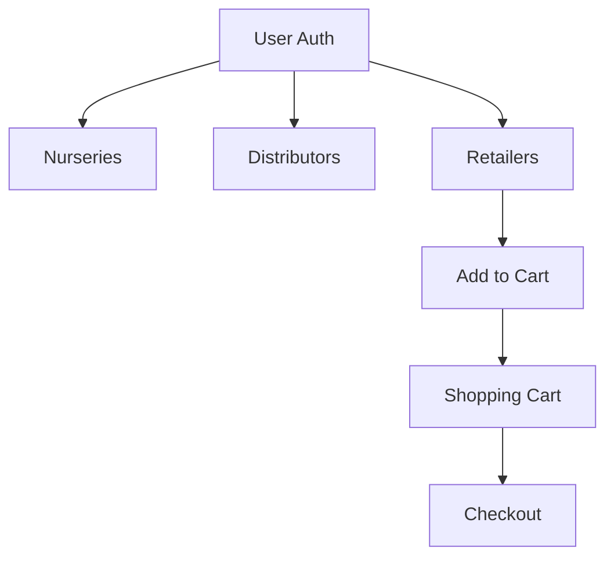

# Thorns 'n' Roses - Flower Supply Chain Management


A React-based application for managing flower supply chain relationships between nurseries, distributors, and retailers. Includes customer-facing features for browsing products and managing a shopping cart.

## Features

- **User Authentication**
  - Login/Registration system with localStorage session management
  - Protected routes with authorization checks
- **Supply Chain Visualization**
  - View nurseries and their grown flowers
  - See distributor relationships and markup pricing
  - Browse retailer inventories with dynamic pricing
- **Shopping Cart**
  - Add flowers from multiple retailers
  - Consolidated cart view with quantity and total cost
  - Local storage persistence
- **Dynamic Pricing**
  - Automatic price calculations with distributor markups
  - Real-time updates when adding to cart
- **Responsive UI**
  - Clean component-based architecture
  - Interactive navigation bar with cart counter

## Installation

1. Clone the repository:
   ```bash
   git clone https://github.com/your-username/thorns-n-roses.git
   cd thorns-n-roses
   ```
2. Install dependencies:
   ```bash
   npm install
   ```
3. Start the application (ensure backend API is running on port 8088):
   ```bash
   npm run dev
   ```

## Usage

1. Register a new account or use default credentials:
   - Email: `alice@email.com`
   - Password: `securePass1`
2. Navigate through supply chain entities:
   - **Nurseries**: View flowers being grown and distributor relationships
   - **Distributors**: See markup percentages and affiliated retailers
   - **Retailers**: Browse available flowers with final consumer pricing
3. Add flowers to cart from multiple retailers
4. View consolidated cart with quantity and total costs
5. Logout using the navigation bar

## API Endpoints

| Service | Endpoint | Method | Description |
|---------|----------|--------|-------------|
| Authentication | `/customers` | POST | User registration |
| Flowers | `/flowers` | GET | Get all flower types |
| Cart | `/shopping_cart` | POST | Add item to cart |
| Retailers | `/retailers` | GET | Get retailer details |
| Distributors | `/distributors` | GET | Get distributor data |
| Nurseries | `/nurseries` | GET | Get nursery information |

## Services Overview

- **UserService**: Handles user authentication and registration
- **CartService**: Manages shopping cart operations and local storage sync
- **FlowerService**: Fetches flower data from API
- **RetailerService**: Gets retailer details with price calculations
- **DistributorService**: Retrieves distributor and nursery relationships

## Key Components

- **Login/Register**: Authentication forms with validation
- **RetailerItem**: Displays retailer info and add-to-cart functionality
- **CartList**: Shows consolidated cart items with total costs
- **DistributorList**: Visualizes distributor networks and markup prices
- **NavBar**: Responsive navigation with cart counter updates

## Data Flow



## Contributing

1. Fork the repository
2. Create a feature branch (`git checkout -b feature/amazing-feature`)
3. Commit changes (`git commit -m 'Add amazing feature'`)
4. Push to branch (`git push origin feature/amazing-feature`)
5. Open a Pull Request

## License

[MIT](https://choosealicense.com/licenses/mit/)

---

**Note**: This project requires a separate backend API running on `http://localhost:8088`. Cart checkout functionality is currently in development.
``````markdown
# Thorns 'n' Roses - Flower Supply Chain Management


A React-based application for managing flower supply chain relationships between nurseries, distributors, and retailers. Includes customer-facing features for browsing products and managing a shopping cart.

## Features

- **User Authentication**
  - Login/Registration system with localStorage session management
  - Protected routes with authorization checks
- **Supply Chain Visualization**
  - View nurseries and their grown flowers
  - See distributor relationships and markup pricing
  - Browse retailer inventories with dynamic pricing
- **Shopping Cart**
  - Add flowers from multiple retailers
  - Consolidated cart view with quantity and total cost
  - Local storage persistence
- **Dynamic Pricing**
  - Automatic price calculations with distributor markups
  - Real-time updates when adding to cart
- **Responsive UI**
  - Clean component-based architecture
  - Interactive navigation bar with cart counter

## Installation

1. Clone the repository:
   ```bash
   git clone https://github.com/your-username/thorns-n-roses.git
   cd thorns-n-roses
   ```
2. Install dependencies:
   ```bash
   npm install
   ```
3. Start the application (ensure backend API is running on port 8088):
   ```bash
   npm run dev
   ```

## Usage

1. Register a new account or use default credentials:
   - Email: `alice@email.com`
   - Password: `securePass1`
2. Navigate through supply chain entities:
   - **Nurseries**: View flowers being grown and distributor relationships
   - **Distributors**: See markup percentages and affiliated retailers
   - **Retailers**: Browse available flowers with final consumer pricing
3. Add flowers to cart from multiple retailers
4. View consolidated cart with quantity and total costs
5. Logout using the navigation bar

## API Endpoints

| Service | Endpoint | Method | Description |
|---------|----------|--------|-------------|
| Authentication | `/customers` | POST | User registration |
| Flowers | `/flowers` | GET | Get all flower types |
| Cart | `/shopping_cart` | POST | Add item to cart |
| Retailers | `/retailers` | GET | Get retailer details |
| Distributors | `/distributors` | GET | Get distributor data |
| Nurseries | `/nurseries` | GET | Get nursery information |

## Services Overview

- **UserService**: Handles user authentication and registration
- **CartService**: Manages shopping cart operations and local storage sync
- **FlowerService**: Fetches flower data from API
- **RetailerService**: Gets retailer details with price calculations
- **DistributorService**: Retrieves distributor and nursery relationships

## Key Components

- **Login/Register**: Authentication forms with validation
- **RetailerItem**: Displays retailer info and add-to-cart functionality
- **CartList**: Shows consolidated cart items with total costs
- **DistributorList**: Visualizes distributor networks and markup prices
- **NavBar**: Responsive navigation with cart counter updates

## Data Flow


## Contributing

1. Fork the repository
2. Create a feature branch (`git checkout -b feature/amazing-feature`)
3. Commit changes (`git commit -m 'Add amazing feature'`)
4. Push to branch (`git push origin feature/amazing-feature`)
5. Open a Pull Request

## License

[MIT](https://choosealicense.com/licenses/mit/)

---

**Note**: This project requires a separate backend API running on `http://localhost:8088`. Cart checkout functionality is currently in development.